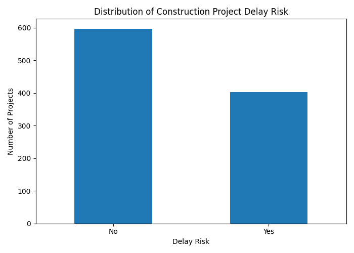
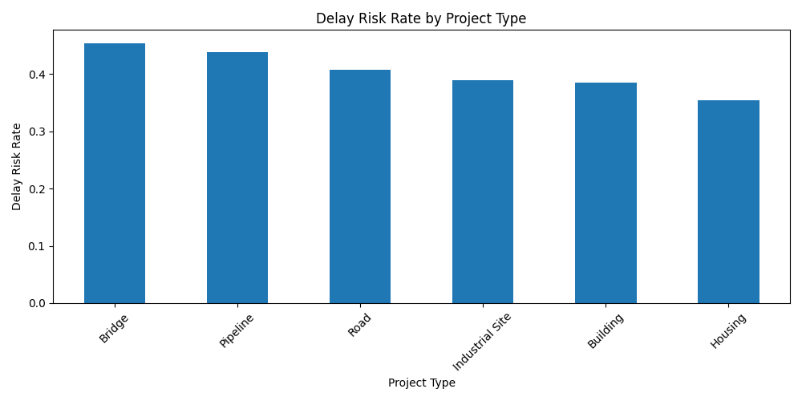
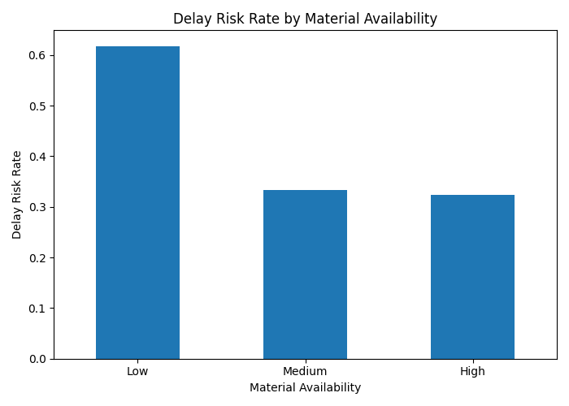
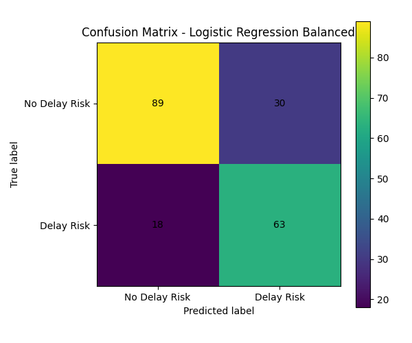
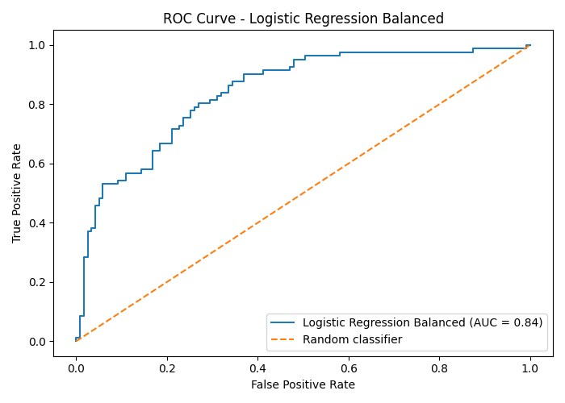
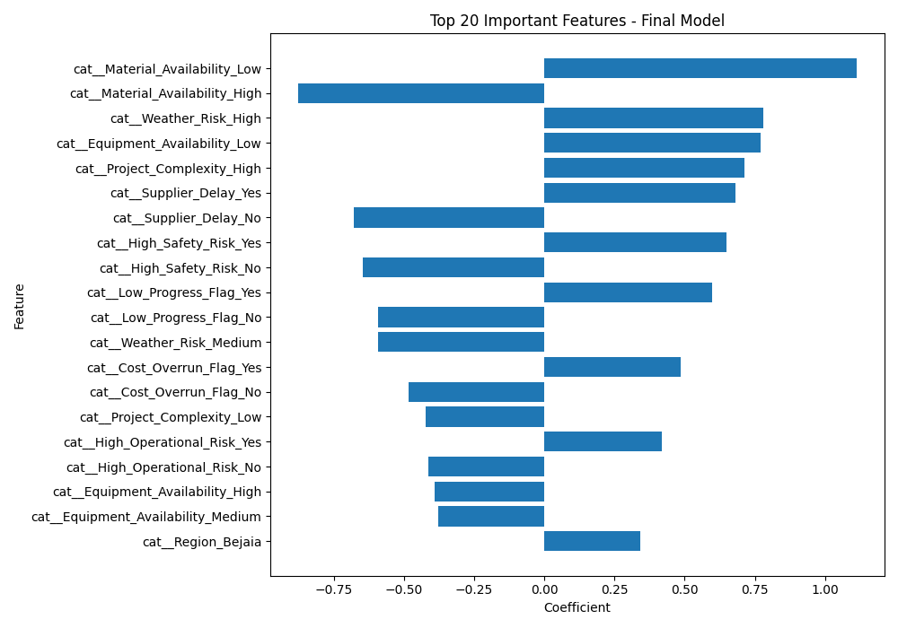
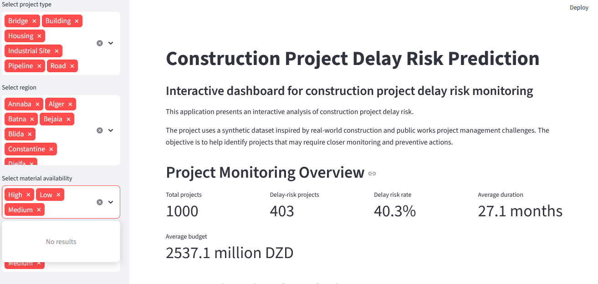

<<<<<<< HEAD
# Construction Project Delay Risk Prediction
## Live Demo

The interactive Streamlit application is available here:

[Open the Streamlit App](https://construction-delay-risk-prediction.streamlit.app/)

## Project Overview

This project focuses on predicting delay risk in construction projects using machine learning.

The project is inspired by real-world challenges in the construction and public works sector, where project delays can lead to cost overruns, planning difficulties, resource misallocation and operational issues.

The dataset used in this project is synthetic and was generated to simulate realistic construction project management conditions.

## Objective

The main objective of this project is to build a machine learning model capable of predicting whether a construction project is at risk of delay.

The model can be used as a decision-support tool to help project managers identify risky projects and take preventive actions before delays become critical.

## Dataset

The dataset contains 1,000 synthetic construction projects.

Each project includes information related to:

- project type;
- region;
- planned duration;
- project progress;
- budget;
- cost used percentage;
- number of workers;
- material availability;
- equipment availability;
- weather risk;
- supplier delays;
- project complexity;
- safety incidents;
- delay risk status.

The target variable is:

`Delay_Risk`

It indicates whether a project is at risk of delay or not.

## Methodology

The project follows a complete machine learning workflow:

1. Synthetic dataset generation
2. Exploratory data analysis
3. Data preprocessing
4. Train-test split
5. Baseline model training
6. Model comparison
7. Threshold optimization
8. Feature engineering
9. Improved model training
10. Final model evaluation
11. Feature importance analysis
12. Business recommendations

## Models Used

The following models were tested:

- Logistic Regression
- Logistic Regression Balanced
- Random Forest
- Gradient Boosting

The final selected model is:

**Logistic Regression Balanced**

This model was selected because it provided the best business-oriented trade-off between accuracy, recall, F1-score and ROC-AUC.

## Final Model Performance

The final model achieved:

| Metric | Score |
|---|---:|
| Accuracy | 0.76 |
| ROC-AUC | 0.84 |
| Recall for Delay Risk | 0.78 |
| F1-score for Delay Risk | 0.72 |

## Key Insights

The most important factors increasing delay risk are:

- low material availability;
- high weather risk;
- low equipment availability;
- high project complexity;
- supplier delays;
- safety risk;
- low project progress;
- cost overrun.

These results are consistent with real-world construction project management challenges.

## Business Recommendations

Based on the analysis, construction companies should:

- monitor material availability closely;
- improve equipment planning;
- strengthen supplier monitoring;
- focus on complex projects;
- use cost overrun as an early-warning indicator;
- track project progress and safety incidents;
- use the model as a decision-support tool.

## Visual Results

### Delay Risk Distribution



### Delay Risk by Project Type



### Delay Risk by Material Availability



### Final Confusion Matrix



### Final ROC Curve



### Feature Importance


## Streamlit Application

An interactive Streamlit dashboard was also developed to present the project results in a user-friendly way.

The application allows users to:

- filter projects by project type, region, material availability and equipment availability;
- monitor key project indicators;
- visualize delay risk distribution;
- compare delay risk by project type and operational factors;
- explore machine learning model results;
- analyze the most important delay risk factors;
- download filtered project data.

### Application Overview



### Interactive Visual Analysis


### Model Results


### Feature Importance in the Application


## Project Structure


```text
construction-delay-risk-prediction/
│
├── data/
│   └── synthetic_construction_projects.csv
│
├── notebook/
│   └── construction_delay_prediction.ipynb
│
├── figures/
│   ├── delay_risk_distribution.png
│   ├── delay_by_project_type.png
│   ├── delay_by_material_availability.png
│   ├── delay_by_equipment_availability.png
│   ├── delay_by_supplier_delay.png
│   ├── cost_used_by_delay_risk.png
│   ├── confusion_matrix_final_model.png
│   ├── roc_curve_final_model.png
│   └── feature_importance_final_model.png
│
├── screenshots/
│   ├── app_overview.png
│   ├── visual_analysis.png
│   ├── model_results.png
│   └── feature_importance_app.png
│
├── app.py
├── model_results.csv
├── feature_importance_final.csv
├── README.md
└── requirements.txt

This project demonstrates the application of data science to construction project monitoring and risk prediction.

It is particularly relevant for companies operating in construction, public works, infrastructure and engineering sectors.

## How to Run the Streamlit App

To run the application locally, install the required dependencies:

```bash
pip install -r requirements.txt
```

Then launch the Streamlit app:

```bash
streamlit run app.py
```

The application will open in the browser at:

```text
http://localhost:8501
```

## Tools Used

- Python
- Pandas
- NumPy
- Matplotlib
- Scikit-learn
- Jupyter Notebook
- Streamlit

## Author

**Chanez Benidir**

Final-year Statistics and Data Science student.  
Interested in data science, machine learning, business analytics, decision-support systems and operational performance analysis.
=======
# Construction-Delay-Risk-Assessment-ML-
>>>>>>> 52bfa2c62d66d393d1c0a3279bd126089946ee97
